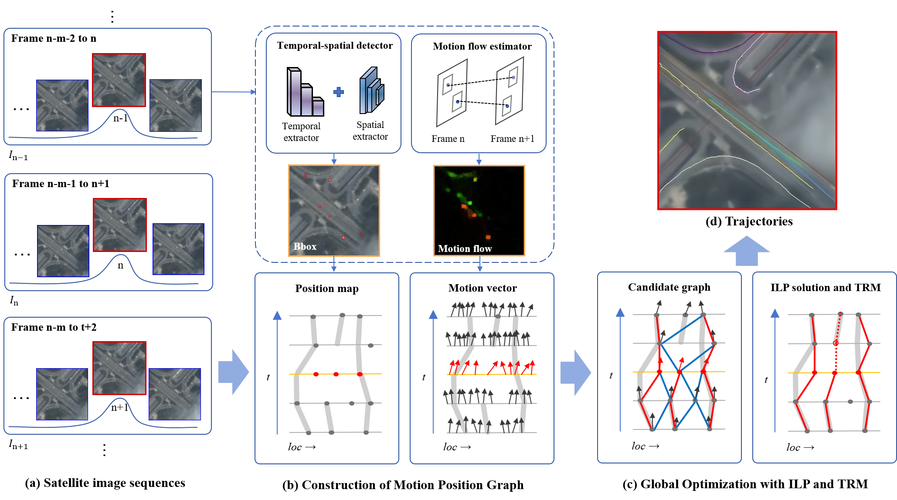
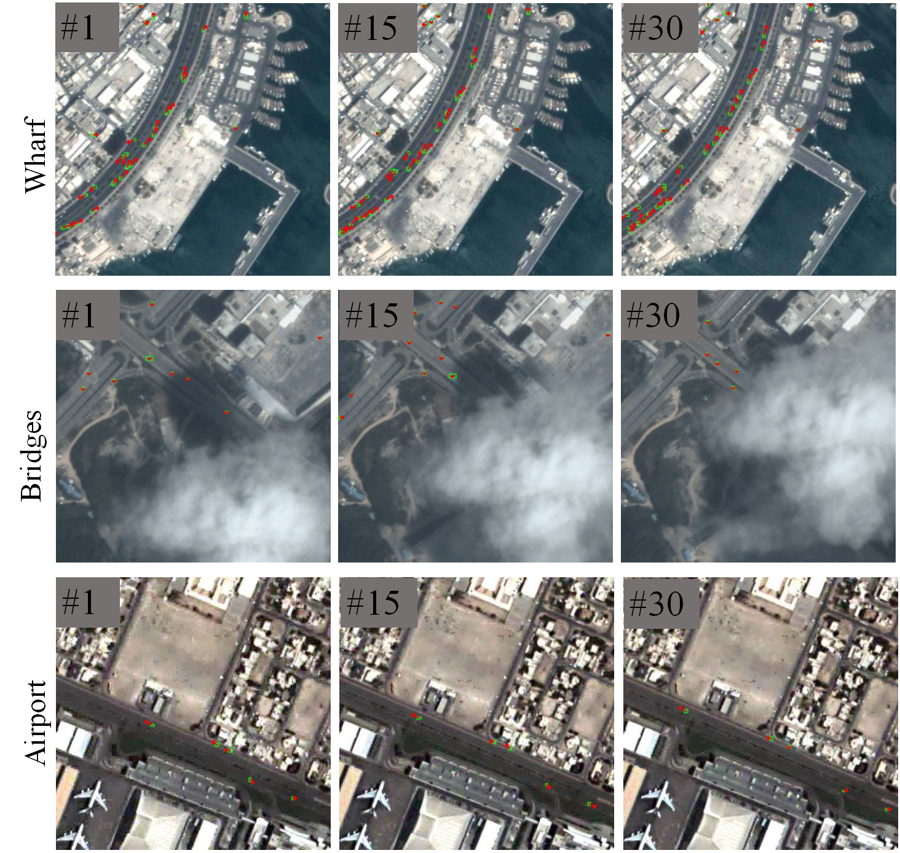

# Satellite-borne Vehicles Tracking: A Motion Position Graph Approach and Dataset



## Algorithm Introduction

This is an implementation for paper "Satellite-borne Vehicles Tracking: A Motion Position Graph Approach and Dataset" (Jia Shao, Zhi Yin, Jian Zhang, Chen Wu, Bo Du, Satellite-borne Vehicles Tracking: A Motion Position Graph Approach and Dataset).

We propose a complete solution for dense vehicle multi-object tracking in satellite videos. First, a dense vehicle tracking dataset for satellite videos, termed VDD-VEH, is constructed by augmenting conventional spatial annotations with motion information. The dataset contains 70,665 images and 15,461 vehicle instances. Second, a Motion Position Graph (MPG) is proposed to map object spatial locations and motion cues into a unified three-dimensional spatio-temporal graph structure. In MPG, nodes are constructed from object locations predicted by DSFNet, while edges are generated from motion flow estimated by RAFT and weighted using a multi-feature edge weighting strategy that integrates spatio-temporal consistency information, thereby formulating multi-object tracking as a global graph optimization problem. Finally, a global trajectory association method based on integer linear programming is designed, together with trajectory filtering and fragment stitching modules, to refine long-term associations and improve the accuracy and completeness of trajectories for small and densely distributed vehicles.

## Download
You can now download the complete datasets directly from [[BaiduYun](https://pan.baidu.com/s/1h2xqaZ2V1D1M_65ZGcWHoA?pwd=aqx2)](Sharing code: aqx2).

The trained weight is available at [[BaiduYun](https://pan.baidu.com/s/1_ZHEmP8nCCQWiui4yRFU1w?pwd=6a8j)](Sharing code: 6a8j). You can download the model and put it to the weights folder.

## Data
VDD-VEH contains 255 video sequences for tracking moving vehicles, of which 177 are used as training sets, 52 as validation sets, and 26 as test sets. All data were captured by the Jilin-1 satellite with a frame rate of 10FPS and a spatial resolution of 0.92m.



The annotation file `gt.txt` contains information in the following format:

 ​Each column corresponds to the following values in order:

- **Frame ID**: The index of the video frame.
- **Target ID**: A unique identifier for each target object.
- **Bounding Box x**: The x-coordinate of the top-left corner of the bounding box.
- **Bounding Box y**: The y-coordinate of the top-left corner of the bounding box.
- **Bounding Box Width**: The width of the bounding box.
- **Bounding Box Height**: The height of the bounding box.
- **Visibility**: Indicates the visibility level of the target.
- **Motion Vector x**: The x-coordinate of the motion vector of the target.
- **Motion Vector y**: The y-coordinate of the motion vector of the target.

## Prerequisite
* Tested on Ubuntu 20.04, with Python 3.10, PyTorch 1.7, Torchvision 0.11.1, CUDA 10.2, and 2x NVIDIA GeForce RTX 4090.
* You can follow [DSFNet](https://github.com/ChaoXiao12/Moving-object-detection-DSFNet) to build the environment.

## Usage

#### On Ubuntu:
#### 1. Train.
```bash
python train.py --model_name DSFNet --gpus 0,1 --lr 1.25e-4 --lr_step 30,45 --num_epochs 55 --batch_size 4 --val_intervals 5  --test_large_size True --datasetname rsdata --data_dir  ./data/RsCarData/
```

#### 2. Test.
```bash
python track.py --model_name DSFNet --gpus 0 --load_model ./weights/model_best.pth --test_large_size True --save_track_results True --data_dir ./data/viso/ --track_cfg ./optim_config.yaml
```

## Quantative Results 

Overall performance on different datasets.

|   Dataset   |  MOTA↑  |  IDF1↑ |  MT↑  |  ML↓  |  FP↓  |  FN↓  |  IDs↓  |
|-------------|---------|--------|-------|-------|-------|-------|--------|
|   VDD-VEH   |  71.4%  |	70.5%  |	 46  |	 4   |	326  |	1444 |	 64   |
|   VISO      |  75.4%  |	74.1%  |	 53  |	 3   |	307  |	886  |	 136  |
|   SAT-MTB   |  73.6%  |	71.9%  |	 50  |	 6   |	314  |	1283 |	 95   |
|   SDM-Car   |  76.3%  |	75.5%  |	 53  |	 3   |	285  |	537  |	 56   |
